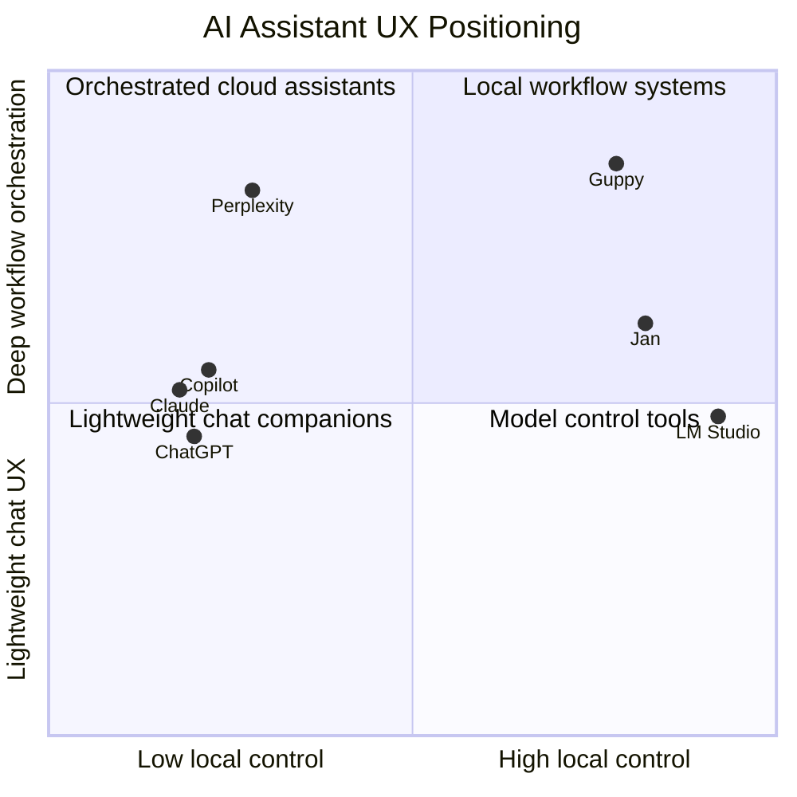

# Competitive UX Analysis

Date: 2026-04-14

Product under analysis: Guppy

Scope: Windows-first, desktop-oriented AI assistant UX with a mix of chat, voice, local-model support, task execution, workspace memory, and productivity workflows.

Method: Public product and feature pages reviewed on 2026-04-14. This is a UX-focused competitive read, not a pricing or benchmark teardown.

Competitors analyzed:

- ChatGPT Desktop
- Claude
- Microsoft Copilot
- Perplexity
- LM Studio
- Jan

## Executive Summary

The competitive field splits into three clear UX archetypes:

1. General-purpose AI companions: ChatGPT, Claude, Microsoft Copilot
2. Research and action surfaces: Perplexity
3. Local-model control panels: LM Studio, Jan

Guppy sits in a more unusual position than any single competitor. It is trying to combine:

- companion-style chat and voice
- local-first model control
- operator-grade recovery and observability
- bounded tool execution
- persona, routing, and voice customization

That combination is strategically strong, but it creates a UX risk: competitors win through sharper focus. ChatGPT and Claude feel simpler. Copilot feels native to Windows. Perplexity feels action-oriented. LM Studio and Jan feel clear about local-model ownership. Guppy’s opportunity is to unify those strengths without inheriting their fragmentation.

## 1. Competitor Overview

| Product | Primary audience | Market positioning | Key differentiators |
| --- | --- | --- | --- |
| ChatGPT Desktop | Broad prosumer and knowledge-worker audience, plus developers | Default mainstream AI desktop companion | Fast global launch shortcut, file/screenshot context, desktop voice, strong brand trust, low-friction generalist UX |
| Claude | Professionals, analysts, writers, teams, and high-trust enterprise users | Calm, high-quality reasoning and work collaboration assistant | Strong writing/reasoning brand, task delegation via Cowork, imported memory, restrained UX tone |
| Microsoft Copilot | Mainstream consumers and Microsoft ecosystem users | Native AI layer across Windows and Microsoft productivity | Windows presence, recent files/apps context, wake word, vision, image generation, ecosystem familiarity |
| Perplexity | Researchers, operators, power users, and workflow-heavy professionals | Answer engine plus action agent | Spaces, connectors, task templates, Computer mode, strong connector catalog, research-first framing |
| LM Studio | Developers, hobbyists, privacy-sensitive local-model users | Local AI runtime and model management workbench | Strong local privacy story, model catalog, OpenAI-compatible API, SDKs, remote instance linking |
| Jan | Privacy-focused users who want a friendlier local AI app | Open-source local assistant with broad provider flexibility | Highly approachable local UX, provider plug-in model, connectors, open-source trust, strong visual polish |

### Positioning Read

- ChatGPT wins on ubiquity and low cognitive load.
- Claude wins on trust, quality, and professional composure.
- Copilot wins on platform adjacency and “already on my machine” energy.
- Perplexity wins on workflow breadth and answer-to-action framing.
- LM Studio wins on developer control and local runtime credibility.
- Jan wins on local AI friendliness and visual accessibility.

### Guppy’s Relative Position

Guppy is closest to a blend of:

- Copilot’s Windows-native assistant framing
- Jan and LM Studio’s local control
- Perplexity’s action orientation
- Claude’s configurable task collaboration

That is differentiated, but only if the UX makes those layers feel intentional rather than additive.

## Visual Comparison: Positioning Map

## 2. Feature Comparison

### Feature Matrix

Legend:

- Yes: strong native support
- Partial: present but secondary, limited, or unclear from public UX
- No: not a visible product strength

| Capability | Guppy | ChatGPT Desktop | Claude | Copilot | Perplexity | LM Studio | Jan |
| --- | --- | --- | --- | --- | --- | --- | --- |
| Desktop app | Yes | Yes | Yes | Yes | Partial | Yes | Yes |
| Global quick access | Partial | Yes | Partial | Yes | Partial | No | Partial |
| Voice conversation | Yes | Yes | Partial | Yes | Partial | No | Partial |
| Wake word / hands-free emphasis | Partial | No | No | Yes | No | No | No |
| Screenshot / screen context | Partial | Yes | Partial | Yes | Partial | No | No |
| Local model runtime | Yes | No | No | No | No | Yes | Yes |
| Cloud provider flexibility | Yes | Partial | No | No | Partial | Partial | Yes |
| Project / workspace organization | Partial | Partial | Partial | Partial | Yes | Partial | Partial |
| Connectors / integrations | Partial | Partial | Yes | Yes | Yes | Partial | Yes |
| Multi-instance or multi-agent framing | Yes | No | No | Partial | Partial | No | Partial |
| Explainable routing / model control | Yes | No | No | No | Partial | Yes | Partial |
| Persona customization | Yes | Partial | Partial | Partial | Partial | Partial | Partial |
| Voice-to-persona/model assignment | Yes | No | No | Partial | No | No | Partial |
| Safe approval-before-action flows | Yes | Partial | Yes | Partial | Partial | No | Partial |
| Recovery / diagnostics in product UI | Yes | No | No | Partial | No | Partial | Partial |

### Feature Parity Analysis

#### Areas where Guppy is ahead

- Local-first model control is more explicit than ChatGPT, Claude, Copilot, and Perplexity.
- Persona, model, and voice assignment are more configurable than most mainstream assistants.
- In-product recovery, diagnostics, and runtime observability go beyond consumer-grade competitors.
- Multi-instance structure is more operationally expressive than single-thread chat products.
- Approval-first builder flow is more safety-conscious than many “just do it” agent surfaces.

#### Areas where Guppy is behind

- Instant discoverability and first-run simplicity trail ChatGPT, Claude, and Copilot.
- Connector breadth trails Perplexity and likely Claude/Copilot ecosystems.
- Default visual clarity around “what should I do here first?” trails Jan and ChatGPT.
- Spaces/projects as a first-class organizational metaphor are weaker than Perplexity’s dedicated workspaces.
- Native-feeling Windows ambient presence still trails Copilot’s OS-adjacent framing.

### Unique Features by Competitor

| Product | Unique or standout feature |
| --- | --- |
| ChatGPT Desktop | Global shortcut plus desktop-native voice and screenshot/file context in a very compressed UX |
| Claude | Calm collaboration framing, imported memory, and approval-gated task delegation |
| Copilot | Windows wake word, recent file/app continuity, and deep Microsoft familiarity |
| Perplexity | Spaces plus Computer plus expansive connectors create a clear “research-to-action” stack |
| LM Studio | Strongest explicit local runtime and developer API framing |
| Jan | Most approachable and visually friendly local AI app among the local-first set |
| Guppy | Unified blend of local models, operational controls, personas, voices, multi-instance runtime, and approval-safe automation |

### Missing Features Relative to the Field

Guppy still lacks visible leadership in:

- first-run onboarding simplicity
- dedicated workspace metaphor with shared context and files
- broad, obvious connector catalog
- polished live health badges and latency evidence inside routing UX
- deeply simplified daily-use mode for non-technical users

## 3. UX Pattern Analysis

### Navigation Patterns

| Product | Navigation pattern | UX consequence |
| --- | --- | --- |
| ChatGPT Desktop | Minimal single-thread chat shell with lightweight entry points into attachments and voice | Very low learning curve, but limited operational depth |
| Claude | Calm primary conversation surface with adjacent capability extensions | Feels focused and premium, but less visibly system-like |
| Copilot | Consumer landing sections plus Windows entry points and feature modules | Familiar, broad, and approachable, but can feel ecosystem-driven rather than task-driven |
| Perplexity | Workspace plus task template plus connector hierarchy | Strong for repeat workflows, but can feel dense |
| LM Studio | Tool/workbench navigation around models, APIs, and developer surfaces | Excellent for technical control, weaker for assistant companionship |
| Jan | Friendly app shell centered on chat, providers, and connectors | More inviting than most local tools, but still secondary on orchestration |
| Guppy | Tabbed launcher with Home, Instances, Agent Tools, App Mgmt, Settings, Models, Voices | Powerful but cognitively heavier than single-surface competitors |

### Information Architecture

The field trends toward three IA models:

1. Conversation-first: ChatGPT, Claude
2. Task/workspace-first: Perplexity
3. Runtime/control-first: LM Studio, Jan

Guppy currently spans all three. That is a strength only if the IA hierarchy becomes sharper:

- Home should feel like the daily assistant
- Spaces or instances should feel like contextual work modes
- Models, Voices, and App Mgmt should feel secondary configuration layers

Right now Guppy risks exposing implementation structure before user intent structure.

### Interaction Patterns

| Pattern | Best-in-class competitor read | Implication for Guppy |
| --- | --- | --- |
| Instant invocation | ChatGPT Desktop, Copilot | Guppy should reduce activation friction and keep “talk now” obvious |
| Approval before action | Claude, Guppy | Good trust pattern worth preserving |
| Workspace setup | Perplexity Spaces | Guppy needs clearer “context container” metaphors |
| Local control | LM Studio, Jan | Guppy should keep advanced control, but hide unnecessary complexity from daily use |
| Voice flow | ChatGPT, Copilot | Guppy should continue emphasizing interruption safety and conversational continuity |

### Visual Design Approach

| Product | Visual style | UX effect |
| --- | --- | --- |
| ChatGPT | Minimal, contemporary, low-friction utility | Feels fast and universal |
| Claude | Soft, calm, editorial, trust-building | Feels thoughtful and premium |
| Copilot | Bright, approachable, Microsoft-brand expressive gradients | Feels native and consumer-friendly |
| Perplexity | Dense, professional, productivity-forward | Feels capable and research-oriented |
| LM Studio | Technical and tool-like | Feels powerful, less warm |
| Jan | Friendly, polished, approachable local-native aesthetic | Makes local AI less intimidating |
| Guppy | Industrial/ops-inflected launcher shell with explicit control surfaces | Distinctive, but needs careful prioritization to avoid feeling like an admin console |

### Content Strategy

Competitors split into two content styles:

- suggestive and lightweight: ChatGPT, Copilot
- capability-signaling and task-directed: Claude, Perplexity, LM Studio, Jan

For Guppy, the best content strategy is likely hybrid:

- lightweight prompts and daily-action affordances on Home
- explicit operator language only inside App Mgmt, Models, and advanced builder areas

## 4. Strengths and Weaknesses

### ChatGPT Desktop

What it does well:

- Extremely low-friction desktop entry
- Strong voice affordance
- Good cross-context capture for files, screenshots, and code
- Clear mainstream mental model

Pain points and weaknesses:

- Limited explicit control over routing, models, and automation safety
- Feels generalist rather than system-native or operations-aware
- Less suitable for users who want local-first privacy or runtime transparency

### Claude

What it does well:

- Clear trust and collaboration tone
- Strong approval-first action framing
- Good fit for long-form thinking and professional use
- Memory import lowers switching cost

Pain points and weaknesses:

- Public UX is less obviously desktop-native and ambient
- Advanced task/action surfaces are less immediately legible than Perplexity’s task framing
- Not a local-first product

### Microsoft Copilot

What it does well:

- Strongest Windows adjacency
- Wake word and voice patterns feel assistant-native
- Recent files/apps framing supports continuity
- Familiar ecosystem value for non-technical users

Pain points and weaknesses:

- Experience can feel broad but diffuse
- Less explicit model/control transparency
- Microsoft ecosystem gravity may limit perceived neutrality or flexibility

### Perplexity

What it does well:

- Strong workspace and action-agent model
- Excellent connector breadth
- Template-driven entry points reduce blank-page anxiety
- Research-to-execution flow is clearer than most competitors

Pain points and weaknesses:

- Can feel dense and operationally busy
- Less personal or companion-like than ChatGPT/Copilot
- Local privacy story is weak relative to Guppy, Jan, or LM Studio

### LM Studio

What it does well:

- Best developer-oriented local model control posture
- Strong API and SDK story
- Clear local privacy and runtime ownership

Pain points and weaknesses:

- UX is more toolbench than assistant
- Weak companion or voice-first identity
- Less approachable for mainstream daily users

### Jan

What it does well:

- Friendlier local AI UX than most local tools
- Good provider flexibility
- Strong open-source and privacy appeal
- Connectors help it feel more assistant-like than pure model managers

Pain points and weaknesses:

- Still less operationally deep than Guppy’s runtime-oriented concept
- Public narrative suggests broad ambition, but some features remain emerging or coming soon
- Can straddle assistant and model-workbench identities without fully owning either

### Guppy

What Guppy already does well:

- Rich control over personas, models, voices, and runtime behavior
- Strong safety and approval orientation
- Distinct Windows-first local-first identity
- More transparent system behavior than mainstream assistants

Current UX gaps:

- Too many high-agency surfaces compete for attention
- Strong control surfaces risk overwhelming daily-use intent
- Home still needs to feel more like a product front door and less like a runtime dashboard
- Connector and workspace narratives are not yet as legible as Perplexity’s or Claude’s

## 5. Opportunities

### Underserved User Needs

The market still underserves users who want all of the following at once:

- local-first privacy
- Windows-native assistant behavior
- voice that interrupts cleanly
- explainable model and persona routing
- bounded automation with approvals
- visible runtime health and recovery

That is exactly the lane Guppy can own.

### UX Improvements Guppy Can Make

1. Create a simpler “daily mode” on Home.
2. Reframe Instances as user-facing workspaces, not just runtime entities.
3. Make route and voice decisions visible in plain language, not only settings vocabulary.
4. Move advanced operational detail deeper into App Mgmt and keep Home calmer.
5. Add guided starter templates for common assistant jobs the way Perplexity does.

### Feature Gaps to Fill

- First-run onboarding with recommended setup paths
- Clear workspace/space metaphor with instructions, files, and recurring context
- Broader connector story or at least better staged connector roadmap communication
- Health badges and live latency evidence in model-routing UX
- Stronger empty states and teaching surfaces for builder workflows

### Design Patterns to Adopt

- ChatGPT: global invocation and ultra-fast start patterns
- Claude: calm approval-before-action interaction copy
- Copilot: Windows continuity and ambient assistant posture
- Perplexity: templated workflows, spaces, connector discoverability
- Jan: friendlier local-first visual tone

### Design Patterns to Avoid

- Exposing system architecture before user jobs-to-be-done
- Overloading Home with operator concerns
- Connector sprawl without prioritization
- “Agent magic” that obscures what will happen before actions execute

## 6. Best Practices

### Patterns Worth Emulating

- Single obvious primary action on entry
- Lightweight voice entry with strong transcript continuity
- Approval checkpoints before state-changing actions
- Workspace containers that combine instructions, files, and context
- Model/provider complexity hidden until the user chooses to go deeper

### Innovative Approaches in the Market

- Perplexity’s combination of Spaces plus Computer plus connectors
- Copilot’s wake-word and recent-context continuity on Windows
- ChatGPT’s global shortcut and desktop-native context capture
- Claude’s imported memory and calm delegation framing
- LM Studio’s OpenAI-compatible local API posture

### Industry Standards

- Conversation-first default surface
- Attachments and file context as expected capabilities
- Voice as a prominent mode, not a hidden extra
- Workspace history and saved context increasingly expected
- Trust and privacy copy now needs to be concrete, not generic

### Emerging Trends

- Answer engines moving into action systems
- Context containers replacing flat conversation history
- Local and hybrid deployment becoming more important for privacy-sensitive users
- Stronger connector ecosystems as a retention moat
- AI products differentiating on orchestration quality, not just model quality

## 7. Recommendations

### What to Learn from Competitors

1. Learn from ChatGPT’s invocation speed and its ruthless focus on immediate usefulness.
2. Learn from Claude’s approval language and calm, high-trust tone.
3. Learn from Copilot’s Windows-native continuity and hands-free posture.
4. Learn from Perplexity’s template-led workflows and workspace architecture.
5. Learn from Jan’s ability to make local AI feel welcoming rather than technical.
6. Learn from LM Studio’s clarity around local runtime ownership and API utility.

### What to Avoid

1. Do not let Guppy feel like six tools sharing one shell.
2. Do not surface control depth before clarifying the user’s main job.
3. Do not copy connector breadth without a clear prioritization model.
4. Do not chase generic consumer polish at the cost of Guppy’s safety and transparency advantages.

### Differentiation Opportunities

Guppy can differentiate as:

- the best Windows local-first assistant
- the safest approval-oriented assistant for real work
- the clearest assistant for model, persona, and voice ownership
- the most operationally transparent assistant without forcing users into a dev tool

### Strategic Recommendations

#### Product strategy

1. Position Guppy as a Windows-first local-first assistant, not just an AI launcher.
2. Lead with trust, continuity, and control instead of model count or raw capability sprawl.
3. Package “local-first with bounded automation” as the core promise.

#### UX strategy

1. Make Home the undeniable primary daily surface.
2. Recast Instances into a user-centered workspace story.
3. Keep App Mgmt advanced and explicit, but visually and narratively separate from daily assistant flow.
4. Add starter flows for common user jobs like morning brief, file triage, builder review, and focused research.

#### Feature strategy

1. Prioritize workspace/context container UX before broad connector expansion.
2. Prioritize routing transparency and live health evidence before adding more models.
3. Prioritize voice reliability and interruption quality as a flagship differentiator.
4. Expand builder templates only after the review-and-approval loop feels effortless.

## Visual Comparison: UX Pattern Scorecard

| Product | Simplicity | Workflow depth | Local privacy | Desktop nativeness | Operational transparency |
| --- | --- | --- | --- | --- | --- |
| ChatGPT Desktop | High | Medium | Low | High | Low |
| Claude | High | Medium | Low | Medium | Low |
| Copilot | High | Medium | Low | High | Low |
| Perplexity | Medium | High | Low | Medium | Medium |
| LM Studio | Medium | Medium | High | Medium | High |
| Jan | Medium-High | Medium | High | Medium | Medium |
| Guppy | Medium | High | High | High | High |

## Bottom Line

No competitor combines Guppy’s local-first posture, persona/model/voice control, multi-instance structure, and runtime-safe operator tooling in one product. The competitive risk is not lack of differentiation. The risk is UX dilution.

If Guppy sharpens its hierarchy into:

1. daily assistant first
2. workspace/context second
3. advanced control third

it can occupy a defensible category that the current market still leaves open.

## Source Notes

Official public pages reviewed during this pass included:

- OpenAI ChatGPT desktop and voice pages
- Anthropic Claude product overview page
- Microsoft Copilot for individuals page
- Perplexity Spaces, Computer, and connectors pages
- LM Studio home and developer pages
- Jan product site
